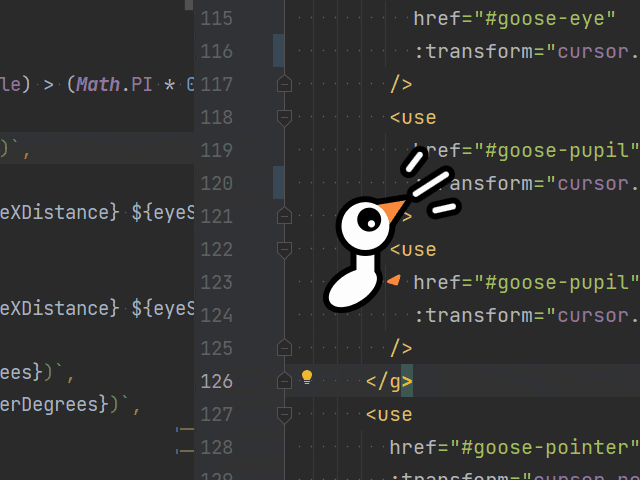
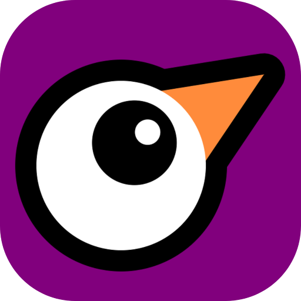

# Helpful Goose

A Helpful Goose that friends and coworkers can control on your screen to stay engaged and point to things.



Great for Pair Programming and Mentoring type situations. Supports multiple remote participants.

This project has two main objectives:

1. To allow a remote collaborator to have a cursor that can point at things on the sharing party's screen to reduce conversational overhead, without granting the ability to make any changes to the sharing party's system.
2. To help a remote collaborator stay more engaged with the task on the remote screen with a gamepad or phone in hand to be able to control a graphical cursor, which really helps people who need a tactile/hands-on and interactive interface to stay focused.

----

## How to install
At the moment, the install process is a little rough around the edges, but these steps will get you started. You must already have [Git](http://git-scm.com/) and [Node.js with NPM](https://nodejs.org/) installed for the following steps to work.

In both cases, you'll need to start with cloning this repository somewhere you'll be able to get at it later.
```bash
git clone https://github.com/AdmiralPotato/helpful_goose.git
```

There are two parts to the application.

### API & Web Server

You'll need this server up and running for the `Overlay Application` to be able to create a session for participants to join.

To install the dependencies for the `API & Web Server`, run the following:
```bash
cd helpful_goose/api
npm install
```

To start it up, run the following in the `api` folder:
```bash
npm run start
```

If you want this to work over the internet, you'll need to host it somewhere publicly accessible, and copy the `.env.example` files to `.env` in both the `api` and the `electron_client` folders, and modify them to contain the network path and port where the API will be running.

### Overlay Application

This is the program you'll need run on the computer where you want to have some gooses overlaying on your screen. Please note that you'll also need to start up the `API & Web Server` below before the `Overlay Application` will be able to connect and give you a session link to share with participants.

To install the dependencies for the `Overlay Application`, run the following:
```bash
cd helpful_goose/electron_client
npm install
```

To start it up, run the following in the `electron_client` folder:
```bash
npm run start
```

----

## Inspirations

These are the inspirations that gave me the idea to start this project. I highly encourage giving these fun games a try yourself:

- [Untitled Goose Game by House House](https://goose.game/)
  - Truly, the original source of chaos
- [Desktop Goose by samperson](https://samperson.itch.io/desktop-goose)
  - Gave me the idea counter some of the chaos and build an overlay application for remote mentoring
- [Websockets Arcade by Admiral Potato and Dmitri Carapezza](https://admirals-websockets-arcade.glitch.me/)
  - A proof of concept arcade game where players can use their phones as controllers on a shared TV
  - Hefty chunks of the [Websockets Arcade repository](https://github.com/AdmiralPotato/websockets-arcade/) were recycled to bootstrap this project
  
Enjoy!


